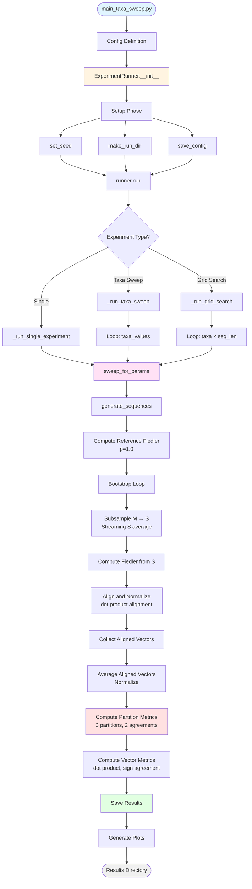

# Sub-sampled Fiedler Vector Experiments

A modular framework for analyzing Fiedler vector quality under sub-sampling, using partition-based metrics that reflect how STDR (Spectral Top-Down Recovery) actually partitions phylogenetic trees.

## Overview

This framework evaluates whether **preprocessing** (subsampling similarity matrices and averaging Fiedler vectors) produces equivalent results to using full data directly in STDR. It supports three types of experiments:

- **Single Experiment**: One parameter combination (n_taxa, sequence_length)
- **Taxa Sweep**: Multiple taxa values, fixed sequence length
- **Grid Search**: Multiple taxa values × multiple sequence lengths

### Scientific Context

**STDR** is a spectral algorithm for recovering latent tree models from observed sequence data. It works by:
1. Computing a similarity matrix M from observed sequences
2. Computing the Fiedler vector (2nd smallest eigenvector) of the Laplacian L(M)
3. Partitioning taxa using **gap-based thresholding** + SVD quality scoring
4. Recursively applying this process to build the tree

**This framework tests**: Does averaging Fiedler vectors from subsampled data preserve STDR's partition quality?

## Key Metrics

The framework computes **4 metrics** to evaluate Fiedler vector quality:

### 1. Partition Agreement Metrics

**Why partition-based?** Simple sign agreement (threshold at zero) doesn't reflect how STDR actually partitions data. STDR uses sophisticated gap-based thresholding that searches for optimal partition points, not just sign changes.

#### partition_agreement_M (Ideal Scenario)
- **Question**: "If we had full data, would averaged Fiedler give same partition as full Fiedler?"
- **Method**: Computes 2 partitions using M (full similarity) for both:
  - `partition_taxa(fiedler_full, M)` [reference]
  - `partition_taxa(fiedler_avg, M)` [test]
- **Range**: 0-100%
- **Interpretation**: Tests vector quality in isolation

####  partition_agreement_S (Realistic Scenario)
- **Question**: "With subsampled data, how close do we get to ideal partition?"
- **Method**: Computes 2 partitions using different matrices:
  - `partition_taxa(fiedler_full, M)` [reference uses full data]
  - `partition_taxa(fiedler_avg, S_avg)` [test uses averaged subsampled data]
- **Range**: 0-100%
- **Interpretation**: Real-world performance measure

### 2. Vector Alignment Metrics

#### dot_product
- **Method**: Absolute dot product between normalized Fiedler vectors
- **Range**: 0-1 (higher = better alignment)
- **Use**: Fast continuous measure of vector similarity

#### sign_agreement (Legacy)
- **Method**: Percentage of entries with matching signs at threshold=0
- **Range**: 0-100%
- **Use**: Backward compatibility and simple baseline

### How Partitions Work

For each p-value, we compute **3 partitions total**:

```python
# 1. Reference partition (baseline)
partition_ref = partition_taxa(fiedler_full, M, num_gaps=1, min_split=1)

# 2. Test partition vs M (ideal scenario)
partition_avg_vs_M = partition_taxa(fiedler_avg, M, num_gaps=1, min_split=1)

# 3. Test partition vs S_avg (realistic scenario)
partition_avg_vs_S = partition_taxa(fiedler_avg, S_avg, num_gaps=1, min_split=1)
```

Then we compare:
- **partition_agreement_M**: partition_ref vs partition_avg_vs_M
- **partition_agreement_S**: partition_ref vs partition_avg_vs_S

**Note**: Partitions A|B and B|A are treated as equivalent (only orientation differs).

## Architecture & Flow



## Component Structure

```
sub_sampled_fielder_vec/
│
├── main_taxa_sweep.py          # Entry point - defines Config and launches experiment
│
├── experiment/                  # Core experiment execution
│   ├── __init__.py
│   ├── experiment_runner.py    # ExperimentRunner class - orchestrates experiments
│   └── bootstrap_sweep.py      # sweep_for_params() - bootstrap logic with streaming S
│
└── utils/                       # Utility modules
    ├── experiment_config.py    # Config dataclass, setup utilities
    ├── summaries.py            # Result saving (JSON, numpy arrays)
    ├── plotting.py             # Visualization (single, multi, faceted plots)
    ├── metrics.py              # Partition-based and vector metrics
    ├── utils.py                # Sequence generation, Fiedler computation
    ├── random_entries.py       # Fiedler estimation from similarity matrices
    ├── fiedler_computer.py     # FiedlerVectorComputer class (sparse/dense)
    ├── similarity_builder.py   # SimilarityMatrixBuilder with caching
    ├── metric_computer.py      # MetricComputer for matrix metrics
    └── logging.py              # Standardized logging utilities
```

## Component Details

### 1. Main Entry Point
**File**: `main_taxa_sweep.py`

- Defines experiment configuration using `Config` dataclass
- Creates `ExperimentRunner` instance
- Triggers experiment execution

### 2. Experiment Runner
**File**: `experiment/experiment_runner.py`

**Class**: `ExperimentRunner`

**Methods**:
- `__init__(cfg)`: Initializes runner, performs setup (seed, directory, config save)
- `run()`: Dispatches to appropriate experiment type based on config
- `_run_single_experiment()`: Single parameter combination
- `_run_taxa_sweep()`: Multiple taxa values
- `_run_grid_search()`: Grid search (taxa × sequence_length)

**Responsibilities**:
- Orchestrates experiment execution
- Manages result saving
- Triggers plotting
- Handles cache clearing between parameter combinations

### 3. Bootstrap Sweep
**File**: `experiment/bootstrap_sweep.py`

**Function**: `sweep_for_params(cfg, n_taxa, seq_len, run_dir)`

**Returns**: `(fiedler_ref, sign_agreements, partition_agreement_M, partition_agreement_S, dot_products, metrics_dict)`

**Process**:
1. Generate sequences for given (n_taxa, seq_len)
2. Compute reference Fiedler vector from full matrix M (p=1.0)
3. For each p-value:
   - **Bootstrap loop** (for K replicates):
     * Subsample similarity matrix: M → S
     * **Update streaming average**: S_avg (using Welford's algorithm - no storage!)
     * Compute Fiedler vector from L(S)
     * Align to reference using dot product
     * Collect aligned vector
   - **After loop**:
     * Average aligned vectors and normalize
     * Compute partition_agreement_M: compare partition_taxa(v_full, M) vs partition_taxa(v_avg, M)
     * Compute partition_agreement_S: compare partition_taxa(v_full, M) vs partition_taxa(v_avg, S_avg)
     * Compute dot_product and sign_agreement
4. Return all metrics

**Memory Optimization**:
- Uses Welford's streaming algorithm to compute S_avg without storing all K matrices
- For n=4000, K=100: saves ~12.8 GB memory
- Only stores one S_avg matrix (~128 MB) instead of 100 S matrices

### 4. Configuration
**File**: `utils/experiment_config.py`

**Class**: `Config` (dataclass)

**Key Parameters**:
- `num_taxa`: int - Number of taxa (single experiment)
- `sequence_length`: int - Sequence length (single experiment)
- `taxa_values`: List[int] | None - Taxa values for sweep
- `sequence_length_values`: List[int] | None - Sequence lengths for grid search
- `mutation_rate`: float - Mutation rate
- `p_values`: List[float] - Sub-sampling probabilities
- `bootstrap_reps`: int - Number of bootstrap replicates
- `seed`: int - Random seed
- `run_name`: str - Experiment name
- `num_gaps`: int = 1 - Number of gap-based thresholds (STDR parameter)
- `min_split`: int = 1 - Minimum partition size (STDR parameter)
- `fiedler_method`: Callable - Function to compute Fiedler vectors (default: `compute_fiedler_from_similarity`)

**Functions**:
- `set_seed()`: Set random seeds for reproducibility
- `make_run_dir()`: Create timestamped results directory
- `progress_milestones()`: Calculate progress printing milestones
- `save_config()`: Save config to JSON

### 5. Metrics
**File**: `utils/metrics.py`

**Partition-Based Metrics**:
- `compute_partition_agreement(v_full, v_avg, sim_full, sim_avg, num_gaps, min_split)`
  - Unified function for both partition_agreement_M and partition_agreement_S
  - Computes 2 partitions using `partition_taxa` from spectraltree
  - Compares partitions (handles A|B ≡ B|A equivalence)
  - Returns percentage agreement (0-100)

- `compute_fiedler_dot_product(v_full, v_avg)`
  - Computes absolute dot product between normalized vectors
  - Returns 0-1 (higher = better alignment)

**Helper Functions**:
- `_normalize_vector(v)` - Normalize to unit length (shared helper)
- `compute_sign_agreement(v1, v2)` - Legacy metric (backward compatibility)

**Matrix Metrics**:
- `metric_composer(M, S, L_M, L_S, p)` - Computes all matrix metrics efficiently
  - Operator norm error, empirical rank, spectral gap, coherence, min separation
  - Delegates to `MetricComputer` class
  - Returns aggregated statistics (mean, median, std)

### 6. Results & Summaries
**File**: `utils/summaries.py`

**Functions**:
- `save_single_results(run_dir, p_values, sign_agreements, partition_agreement_M, partition_agreement_S, dot_products, metrics_dict)`
  - Saves single experiment results
  - Backward compatible with legacy formats

- `save_taxa_results()`: Save taxa sweep results
- `save_grid_results()`: Save grid search results

**Output Format**: JSON tables with columns:

**Single Experiment**:
```json
{
  "columns": ["p", "sign_agreement", "partition_agreement_M", "partition_agreement_S", "dot_product", ...],
  "rows": [
    {
      "p": 1.0,
      "sign_agreement": 100.0,
      "partition_agreement_M": 100.0,
      "partition_agreement_S": 100.0,
      "dot_product": 1.0,
      ...
    }
  ]
}
```

**Matrix Metrics**: Each metric includes `mean_{metric}`, `median_{metric}`, `std_{metric}` columns.

### 7. Plotting
**File**: `utils/plotting.py`

**Functions**:
- `plot_from_json_simple()`: Plot agreement metrics vs p for single/taxa experiments
- `plot_faceted_by_sequence_length()`: Faceted plots for grid search
- `plot_fiedler_vectors()`: Visualize Fiedler vectors

### 8. Fiedler Computation
**File**: `utils/random_entries.py`

**Functions**:
- `compute_fiedler_from_similarity(similarity_matrix)` - **NEW strict version**
  - Requires S to be provided (fail-fast if None)
  - Use when S is already computed
  - Default fiedler_method in Config

- `compute_fiedler_estimate(observations, p, ...)` - Legacy version
  - Computes S from observations internally
  - Kept for backward compatibility

- `_subsample_matrix_entries(M, p, seed)` - Subsample and scale by 1/p
- `_get_cached_similarity_matrix(observations)` - Cached full similarity computation

**File**: `utils/fiedler_computer.py`

**Class**: `FiedlerVectorComputer`
- Automatic sparse/dense method selection based on sparsity
- Consistent sign convention enforcement
- Efficient for large matrices

## Usage Examples

### Single Experiment
```python
from utils.experiment_config import Config
from experiment.experiment_runner import ExperimentRunner

cfg = Config(
    num_taxa=8192,
    sequence_length=1000,
    mutation_rate=0.1,
    p_values=(1e-4, 1e-3, 1e-2, 1e-1, 1.0),
    bootstrap_reps=100,
    num_gaps=1,        # STDR parameter
    min_split=1,       # STDR parameter
    run_name="single_experiment"
)

runner = ExperimentRunner(cfg)
run_dir, results = runner.run()
```

### Taxa Sweep
```python
import numpy as np

cfg = Config(
    taxa_values=[1024, 2048, 4096, 8192],
    sequence_length=1000,  # Fixed
    mutation_rate=0.3,
    p_values=tuple(np.logspace(-4, 0, 15)),
    bootstrap_reps=30,
    run_name="taxa_sweep"
)

runner = ExperimentRunner(cfg)
run_dir, results = runner.run()
```

### Grid Search
```python
cfg = Config(
    taxa_values=[1024, 2048, 4096],
    sequence_length_values=[500, 1000, 2000],
    mutation_rate=0.3,
    p_values=tuple(np.logspace(-4, 0, 15)),
    bootstrap_reps=30,
    run_name="grid_search"
)

runner = ExperimentRunner(cfg)
run_dir, results = runner.run()
```

## Data Flow

### Detailed Algorithm

1. **Configuration** → `Config` object defines experiment parameters

2. **Setup** → Seed set, run directory created, config saved

3. **Sequence Generation** → Tree model generates sequences for each (n_taxa, seq_len)

4. **Reference Computation** → Full Fiedler vector computed from full matrix M (p=1.0)

5. **Bootstrap Iteration** → For each p-value:

   **Initialize**:
   - `aligned_vectors = []`
   - `S_avg = None` (for streaming average)
   - `n_bootstrap_collected = 0`

   **For each bootstrap replicate k**:
   - a. Sub-sample: M → S (using probability p, seed=cfg.seed + k)
   - b. **Update streaming S average** (Welford's algorithm):
     ```python
     if S_avg is None:
         S_avg = S.copy()
         n_bootstrap_collected = 1
     else:
         n_bootstrap_collected += 1
         S_avg += (S - S_avg) / n_bootstrap_collected
     ```
   - c. Compute Fiedler vector: L(S) → v_k (using `compute_fiedler_from_similarity(S)`)
   - d. Align to reference: if (v_k · u) < 0, then v_k = -v_k
   - e. Collect: `aligned_vectors.append(v_k)`

   **After bootstrap loop**:
   - f. Average and normalize: `v_avg = mean(aligned_vectors); v_avg /= ||v_avg||`
   - g. Compute partition metrics:
     ```python
     partition_agreement_M = compute_partition_agreement(u, v_avg, M, M, num_gaps, min_split)
     partition_agreement_S = compute_partition_agreement(u, v_avg, M, S_avg, num_gaps, min_split)
     ```
   - h. Compute vector metrics:
     ```python
     dot_product = compute_fiedler_dot_product(u, v_avg)
     sign_agreement = compute_sign_agreement(u, v_avg)  # legacy
     ```

6. **Metrics Aggregation** → Matrix metrics aggregated as (mean, median, std) across bootstrap reps

7. **Saving** → Results saved as JSON tables and numpy arrays

8. **Visualization** → Plots generated

### Key Implementation Details

**Streaming S Average**:
- Uses Welford's online algorithm for numerical stability
- Avoids storing K bootstrap matrices
- Memory: O(n²) instead of O(K×n²)

**Partition Computation**:
- Directly calls `partition_taxa` from spectraltree library
- No reimplementation - uses battle-tested STDR algorithm
- Handles partition orientation automatically (A|B ≡ B|A)

**Error Handling**:
- `partition_taxa` can raise exceptions if partitions violate `min_split`
- Exceptions caught at call site, logged as warnings
- Failed metrics stored as NaN

## Expected Outcomes

### Sanity Checks
- **p=1.0**: All metrics should be perfect
  - `partition_agreement_M = 100%`
  - `partition_agreement_S = 100%`
  - `dot_product = 1.0`
  - `sign_agreement = 100%`

### General Trends
- **High p (> 0.5)**:
  - `partition_agreement_M` ≈ `sign_agreement` ± 1%
  - `partition_agreement_S` ≈ `partition_agreement_M` ± 2%

- **Medium p (0.1-0.5)**:
  - Metrics may diverge by 2-5%
  - Gap-based thresholding effects become visible

- **Low p (< 0.1)**:
  - Significant divergence possible (5-15%)
  - `partition_agreement_S` ≤ `partition_agreement_M` (realistic is harder)

## Output Structure

```
results/
└── YYYYMMDD-HHMMSS-{run_name}/
    ├── config.json                    # Experiment configuration
    ├── results.json                   # Single experiment results (with new metrics)
    ├── results_taxa.json              # Taxa sweep results
    ├── results_grid.json              # Grid search results
    ├── sign_agreements.npy            # Raw agreement arrays
    ├── fiedler_ref*.npy               # Reference Fiedler vectors
    ├── plot_single.png                # Single experiment plot
    ├── plot_multi_taxa.png            # Taxa sweep plot
    ├── plot_grid_faceted.png          # Grid search faceted plot
    └── fiedler_vectors*.png           # Fiedler vector visualizations
```

### Example JSON Output

```json
{
  "columns": [
    "p",
    "sign_agreement",
    "partition_agreement_M",
    "partition_agreement_S",
    "dot_product",
    "mean_operator_norm_error",
    "..."
  ],
  "rows": [
    {
      "p": 1.0,
      "sign_agreement": 100.0,
      "partition_agreement_M": 100.0,
      "partition_agreement_S": 100.0,
      "dot_product": 1.0,
      "mean_operator_norm_error": 0.0,
      "..."
    },
    {
      "p": 0.1,
      "sign_agreement": 95.2,
      "partition_agreement_M": 96.8,
      "partition_agreement_S": 94.1,
      "dot_product": 0.987,
      "mean_operator_norm_error": 0.234,
      "..."
    }
  ]
}
```

## Performance Considerations

### Memory Optimization
- **Streaming S average**: Saves ~K×n² memory (12.8 GB for n=4000, K=100)
- **Similarity caching**: M computed once per (n_taxa, seq_len) combination
- **Cache clearing**: Automatic between parameter combinations in sweeps

### Computational Cost

**Per p-value**:
- **Partition metrics**:
  - O(n log n) for sorting
  - O(k × SVD(S_AB)) where k=num_gaps (typically k=1)
  - SVD cost: O(min(|A|, |B|)²)
  - Called once per p-value (not per bootstrap!)

- **Vector metrics**: O(n) - negligible

**Total per experiment**:
- Single: O(|p_values| × bootstrap_reps × n²)
- Taxa sweep: O(|taxa_values| × |p_values| × bootstrap_reps × n²)
- Grid: O(|taxa_values| × |seq_lengths| × |p_values| × bootstrap_reps × n²)

## Dependencies

- `numpy` - Numerical computations
- `scipy` - Linear algebra (Fiedler vector, SVD)
- `matplotlib` - Plotting
- `spectraltree` - Tree generation, sequence simulation, and STDR's `partition_taxa`

## Mathematical Background

### Fiedler Vector
The Fiedler vector is the eigenvector corresponding to the second-smallest eigenvalue of the graph Laplacian. For a similarity matrix M:

```
L = D - M  (unnormalized Laplacian)
where D is diagonal matrix with D_ii = sum(M_i,*)
```

The Fiedler vector provides a natural way to bipartition the graph/tree.

### STDR Algorithm
Spectral Top-Down Recovery partitions taxa recursively:
1. Compute Fiedler vector v from L(M)
2. Find optimal partition threshold:
   - Try threshold=0 first
   - Search num_gaps largest gaps in sorted v
   - For each gap, score partition using σ₂(S_AB) (2nd singular value of cross-partition submatrix)
   - Choose partition with minimum σ₂ (best separation)
3. Recursively partition each side

**Why partition metrics matter**: Simple sign agreement only tests threshold=0, missing the gap-based optimization that STDR actually uses.

## Backward Compatibility

- Legacy `sign_agreement` metric still computed and saved
- Old `compute_fiedler_estimate` function still available
- Old JSON formats with (mean, median, std) tuples still supported
- New experiments automatically use new partition-based metrics
- No breaking changes to existing code

## Troubleshooting

### Partition Metric Failures
If `partition_taxa` fails (raises exception):
- Check `min_split` constraint - partitions must have ≥ min_split taxa on each side
- Increase `num_gaps` to give more partition options
- Check for degenerate Fiedler vectors (all zeros, all same value)

### Memory Issues
- Reduce `bootstrap_reps` for large n
- Streaming S average should handle up to n=10,000
- Clear cache manually with `clear_similarity_cache()` if needed

### Slow Performance
- Partition metrics add ~0.1-5s per p-value depending on n
- Use sparse methods automatically for sparse matrices
- Consider reducing `num_gaps` (1 is usually sufficient)

## Citation

If you use this framework, please cite the STDR paper:

**Spectral top-down recovery of latent tree models**
Roch, S. (2006)
