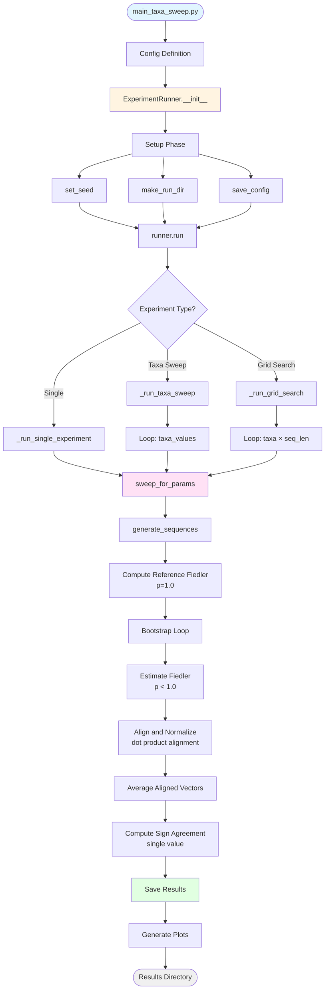

# Sub-sampled Fiedler Vector Experiments

A modular framework for running bootstrap sweep experiments to analyze Fiedler vector stability across different parameter combinations.

## Overview

This framework supports three types of experiments:
- **Single Experiment**: One parameter combination (n_taxa, sequence_length)
- **Taxa Sweep**: Multiple taxa values, fixed sequence length
- **Grid Search**: Multiple taxa values × multiple sequence lengths

## Architecture & Flow



## Component Structure

```
sub_sampled_fielder_vec/
│
├── main_taxa_sweep.py          # Entry point - defines Config and launches experiment
│
├── experiment/                  # Core experiment execution
│   ├── __init__.py
│   ├── experiment_runner.py    # ExperimentRunner class - orchestrates experiments
│   └── bootstrap_sweep.py      # sweep_for_params() - bootstrap iteration logic
│
└── utils/                       # Utility modules
    ├── experiment_config.py    # Config dataclass, setup utilities
    ├── bootstrap_sweep.py      # Core bootstrap logic
    ├── summaries.py            # Result saving (JSON, numpy arrays)
    ├── plotting.py             # Visualization (single, multi, faceted plots)
    ├── metrics.py              # compute_sign_agreement()
    ├── utils.py                # Sequence generation, Fiedler computation
    ├── random_entries.py       # Fiedler estimation with sub-sampling
    └── debug_functions.py      # Debug utilities (optional)
```

## Component Details

### 1. Main Entry Point
**File**: `main_taxa_sweep.py`

- Defines experiment configuration using `Config` dataclass
- Creates `ExperimentRunner` instance
- Triggers experiment execution

### 2. Experiment Runner
**File**: `experiment/experiment_runner.py`

**Class**: `ExperimentRunner`

**Methods**:
- `__init__(cfg)`: Initializes runner, performs setup (seed, directory, config save)
- `run()`: Dispatches to appropriate experiment type based on config
- `_run_single_experiment()`: Single parameter combination
- `_run_taxa_sweep()`: Multiple taxa values
- `_run_grid_search()`: Grid search (taxa × sequence_length)

**Responsibilities**:
- Orchestrates experiment execution
- Manages result saving
- Triggers plotting
- Handles cache clearing

### 3. Bootstrap Sweep
**File**: `experiment/bootstrap_sweep.py`

**Function**: `sweep_for_params(cfg, n_taxa, seq_len, run_dir)`

**Process**:
1. Generate sequences for given (n_taxa, seq_len)
2. Compute reference Fiedler vector u (p=1.0)
3. For each p-value:
   - Run bootstrap iterations:
     * Subsample similarity matrix M → S
     * Compute Fiedler vector v_k from Laplacian(S)
     * Normalize v_k
     * Align to reference using dot product
     * Accumulate aligned vector
   - Average aligned vectors and normalize
   - Compute single sign agreement with reference
4. Aggregate matrix metrics (operator norm error, spectral gap, etc.) as (mean, median, std)

### 4. Configuration
**File**: `utils/experiment_config.py`

**Class**: `Config` (dataclass)

**Key Parameters**:
- `num_taxa`: int - Number of taxa (single experiment)
- `sequence_length`: int - Sequence length (single experiment)
- `taxa_values`: List[int] | None - Taxa values for sweep
- `sequence_length_values`: List[int] | None - Sequence lengths for grid search
- `mutation_rate`: float - Mutation rate
- `p_values`: List[float] - Sub-sampling probabilities
- `bootstrap_reps`: int - Number of bootstrap replicates
- `seed`: int - Random seed
- `run_name`: str - Experiment name
- `debug`: bool - Enable debug output

**Functions**:
- `set_seed()`: Set random seeds
- `make_run_dir()`: Create timestamped results directory
- `progress_milestones()`: Calculate progress printing milestones
- `save_config()`: Save config to JSON

### 5. Results & Summaries
**File**: `utils/summaries.py`

**Functions**:
- `save_single_results()`: Save single experiment results
- `save_taxa_results()`: Save taxa sweep results
- `save_grid_results()`: Save grid search results

**Output Format**: JSON tables with columns:
- Single: `["p", "sign_agreement"]` - single agreement value per p
- Taxa: `["num_taxa", "p", "sign_agreement"]`
- Grid: `["num_taxa", "sequence_length", "p", "sign_agreement"]`

Additionally, matrix metrics are included with aggregated statistics:
- Each metric has columns: `["mean_{metric}", "median_{metric}", "std_{metric}"]`
- Metrics include: operator_norm_error, empirical_rank, spectral_gap, coherence, min_separation

**Note**: The code maintains backward compatibility with legacy formats that used (mean, median, std) tuples for sign agreements.

### 6. Plotting
**File**: `utils/plotting.py`

**Functions**:
- `plot_from_json_simple()`: Plot sign agreement vs p for single/taxa experiments
- `plot_faceted_by_sequence_length()`: Faceted plots for grid search (one panel per sequence length)
- `plot_fiedler_vectors()`: Visualize Fiedler vectors

### 7. Core Utilities
**File**: `utils/utils.py`

**Functions**:
- `generate_sequences()`: Generate sequences using tree model
- `compute_fielder_vector()`: Compute Fiedler vector from similarity matrix
- `align_fiedler_vector()`: Align vector sign to reference

### 8. Metrics
**File**: `utils/metrics.py`

**Functions**:
- `compute_sign_agreement()`: Compute percentage sign agreement between vectors

### 9. Fiedler Estimation
**File**: `utils/random_entries.py`

**Functions**:
- `compute_fiedler_estimate()`: Estimate Fiedler vector with sub-sampling
- `clear_similarity_cache()`: Clear similarity matrix cache

## Usage Examples

### Single Experiment
```python
from utils.experiment_config import Config
from experiment.experiment_runner import ExperimentRunner

cfg = Config(
    num_taxa=8192,
    sequence_length=1000,
    mutation_rate=0.1,
    p_values=(1e-4, 1e-3, 1e-2, 1e-1, 1.0),
    bootstrap_reps=100,
    run_name="single_experiment"
)

runner = ExperimentRunner(cfg)
run_dir, results = runner.run()
```

### Taxa Sweep
```python
cfg = Config(
    taxa_values=[1024, 2048, 4096, 8192],
    sequence_length=1000,  # Fixed
    mutation_rate=0.3,
    p_values=tuple(np.logspace(-4, 0, 15)),
    bootstrap_reps=30,
    run_name="taxa_sweep"
)

runner = ExperimentRunner(cfg)
run_dir, results = runner.run()
```

### Grid Search
```python
cfg = Config(
    taxa_values=[1024, 2048, 4096],
    sequence_length_values=[500, 1000, 2000],
    mutation_rate=0.3,
    p_values=tuple(np.logspace(-4, 0, 15)),
    bootstrap_reps=30,
    run_name="grid_search"
)

runner = ExperimentRunner(cfg)
run_dir, results = runner.run()
```

## Data Flow

1. **Configuration** → `Config` object defines experiment parameters
2. **Setup** → Seed set, run directory created, config saved
3. **Sequence Generation** → Tree model generates sequences for each (n_taxa, seq_len)
4. **Reference Computation** → Full Fiedler vector `u` computed from full matrix M (p=1.0)
5. **Bootstrap Iteration** → For each p-value and each bootstrap replicate:
   - a. Sub-sample similarity matrix: M → S (using probability p)
   - b. Compute Fiedler vector of Laplacian(S) → v_k
   - c. Normalize: v_k /= ||v_k||
   - d. Align to reference using dot product: if (v_k · u) < 0, then v_k = -v_k
   - e. Accumulate aligned vector: v_avg += v_k
6. **Average and Evaluate** → For each p-value:
   - Normalize averaged vector: v_avg /= ||v_avg||
   - Compute single sign agreement: agreement(u, v_avg)
7. **Metrics Aggregation** → Matrix metrics (operator norm error, spectral gap, etc.) aggregated as (mean, median, std)
8. **Saving** → Results saved as JSON tables and numpy arrays
9. **Visualization** → Plots generated (single, multi-taxa, or faceted)

### Key Changes in Bootstrap Methodology

**New approach (current):**
- Collect all aligned Fiedler vectors across bootstrap iterations
- Average the aligned vectors to create a single mean vector
- Compute sign agreement once between the mean vector and reference
- Result: Single agreement value per p-value

**Legacy approach (pre-2025):**
- Computed individual sign agreements for each bootstrap iteration
- Aggregated the agreements as (mean, median, std)
- Result: Statistics tuple per p-value

The new approach provides a more stable estimate by leveraging the averaged structure across all bootstrap samples.

## Output Structure

```
results/
└── YYYYMMDD-HHMMSS-{run_name}/
    ├── config.json                    # Experiment configuration
    ├── results.json                   # Single experiment results
    ├── results_taxa.json             # Taxa sweep results
    ├── results_grid.json             # Grid search results
    ├── sign_agreements*.npy          # Raw statistics arrays
    ├── fiedler_ref*.npy              # Reference Fiedler vectors
    ├── plot_single.png               # Single experiment plot
    ├── plot_multi_taxa.png           # Taxa sweep plot
    ├── plot_grid_faceted.png         # Grid search faceted plot
    └── fiedler_vectors*.png          # Fiedler vector visualizations
```

## Dependencies

- `numpy` - Numerical computations
- `scipy` - Linear algebra (Fiedler vector computation)
- `matplotlib` - Plotting
- `spectraltree` - Tree generation and sequence simulation

